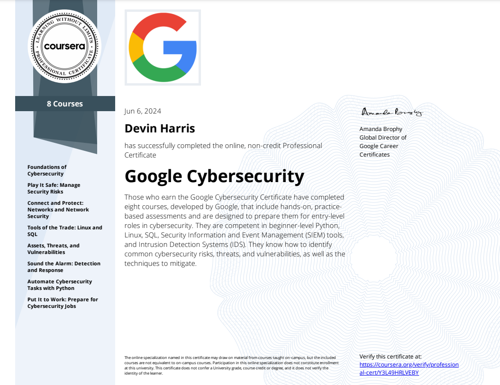

# Google Cybersecurity Portfolio

In this course, I've acquired foundational knowledge that equips me for entry-level cybersecurity roles and enhances my understanding of how security teams safeguard their organizations and customers.

Links to my certification of completion - [Credly] (https://www.credly.com/badges/d3be0bfc-b44a-4a8f-a52d-5e8b75200b26/public_url) and [Coursera] (https://coursera.org/share/adb5aeae5e2fe743116ec20d6ebd8b73).

Topics covered over the course:

- Risk management
- Threat analysis
- Network security
- Incident response

Technical skills learned over the course:

- Linux
- Python
- SQL
- SIEM tools (Splunk and Chronicle)
- Network protocol analyzers (Wireshark and tcpdump)
- IDS/IPS tools
- Firewalls
  

Each directory holds the files for each of the courses in the certificate and the order they were completed in is:

1. Foundations of Cybersecurity 
2. Play It Safe: Manage Security Risks 
3. Connect and Protect: Networks and Network Security 
4. Tools of the Trade: Linux and SQL 
5. Assets, Threats, and Vulnerabilities 
6. Sound the Alarm: Detection and Response 
7. Automate Cybersecurity Tasks with Python 
8. Put It to Work: Prepare for Cybersecurity Jobs (No files needed) 
